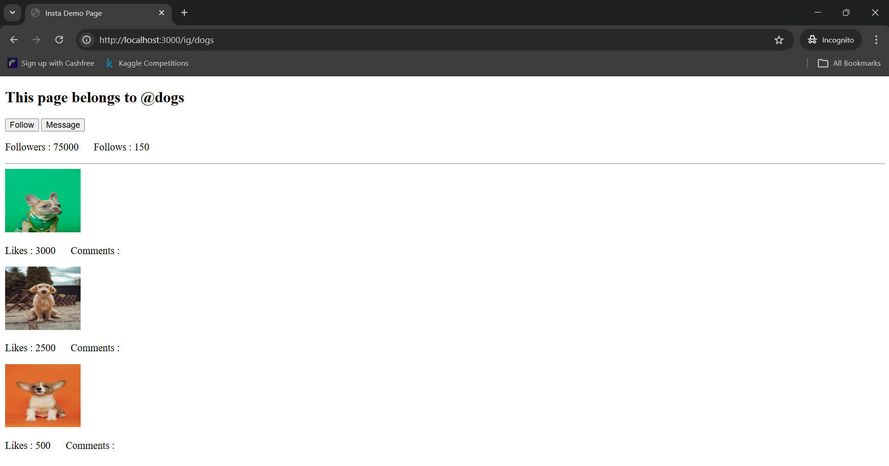
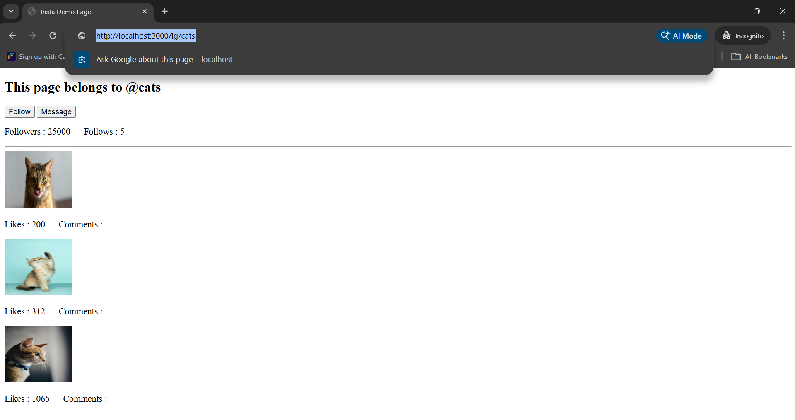

## Insta Profile Viewer (EJS Practice)

This is a small Express + EJS practice project that displays Instagram-like profile pages using dynamic routing.

The route `/ig/:username` fetches profile data from a local `data.json` file. The JSON file contains mock Instagram accounts for **cats** and **dogs**, including followers, following, post images, likes, and comment counts.

When a valid username such as `/ig/cats` or `/ig/dogs` is entered, the data is passed to `insta.ejs` and rendered dynamically. If the username does not exist, an error page (`error.ejs`) is shown.

This project helps understand `req.params`, passing data to EJS templates, and conditional rendering in Express.

Sample outputs are shown below.

This project is made only for learning and practice.
