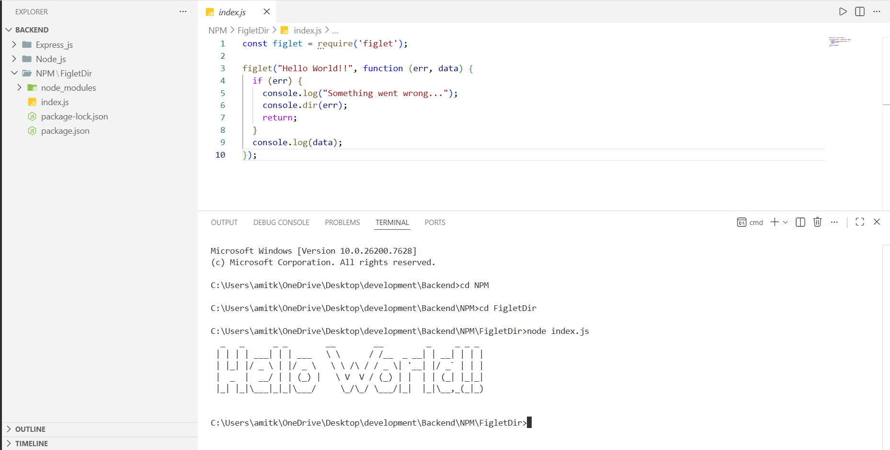

# NPM Study & Practice – Figlet Installation

## What I Studied About NPM
**NPM (Node Package Manager)** is a tool that comes with Node.js and is used to:

- Install external libraries (packages)
- Manage project dependencies
- Run scripts
- Update or remove packages
- Maintain project details using `package.json`

---

## Important NPM Concepts

### 1. `package.json`
- Acts like a **project ID card**
- Contains:
  - Project name & version
  - Dependencies
  - Scripts
  - Author info

### 2. `node_modules`
- Folder where all installed packages are stored
- Automatically created after `npm install`
- Should not be edited manually
- Usually ignored in Git (`.gitignore`)

### 3. NPM Commands

| Command | Purpose |
|--------|---------|
| `npm init -y` | Initialize a new Node project |
| `npm install <package>` | Install a package |
| `npm uninstall <package>` | Remove a package |
| `npm update` | Update packages |
| `npm start` | Run start script |

---

