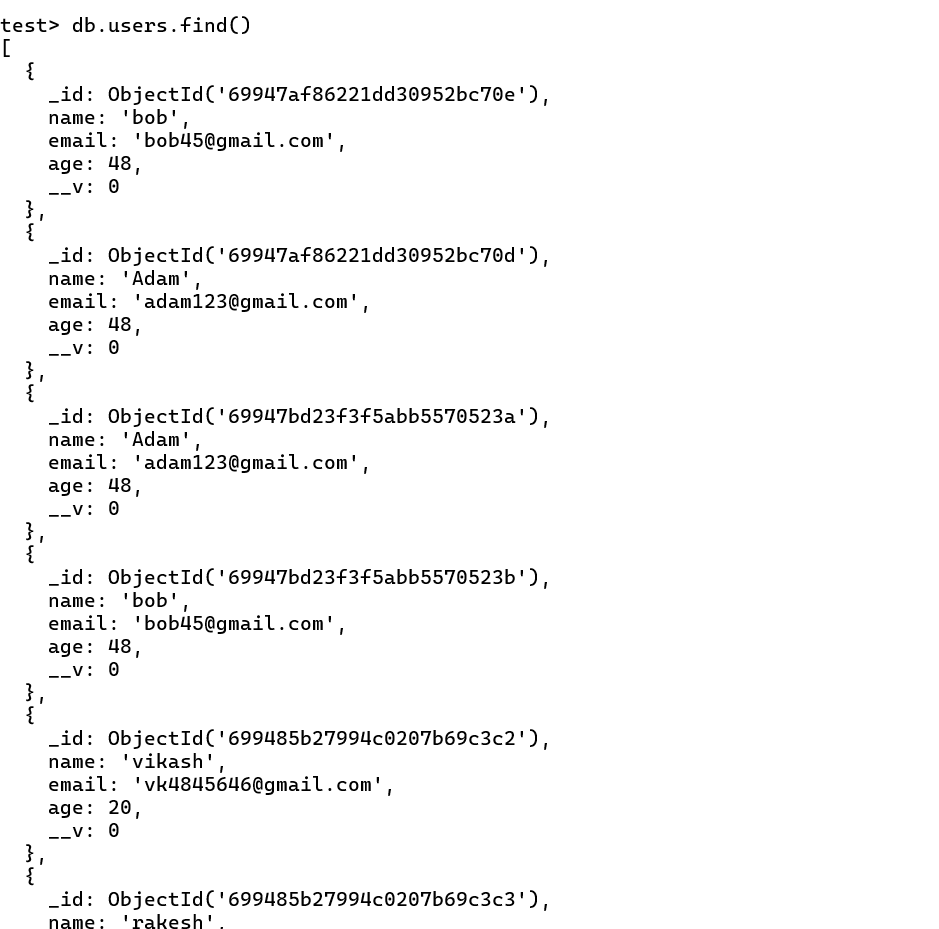

# MongoDB Data Insertion using Mongoose

I used the **Mongoose library** with Node.js to connect to my MongoDB **test database** and perform data insertion operations.

### What I Did
- Connected Node.js with MongoDB using Mongoose.
- Inserted a single user document.
- Inserted multiple user records using batch insertion.
- Verified that all records were successfully stored in the `test` database.

### Result
All user data was inserted correctly and can be seen in MongoDB Compass.

See proof of inserted records here:  

### Conclusion
Successfully learned how to sync Node.js with MongoDB using Mongoose and perform different types of data insertion operations.
