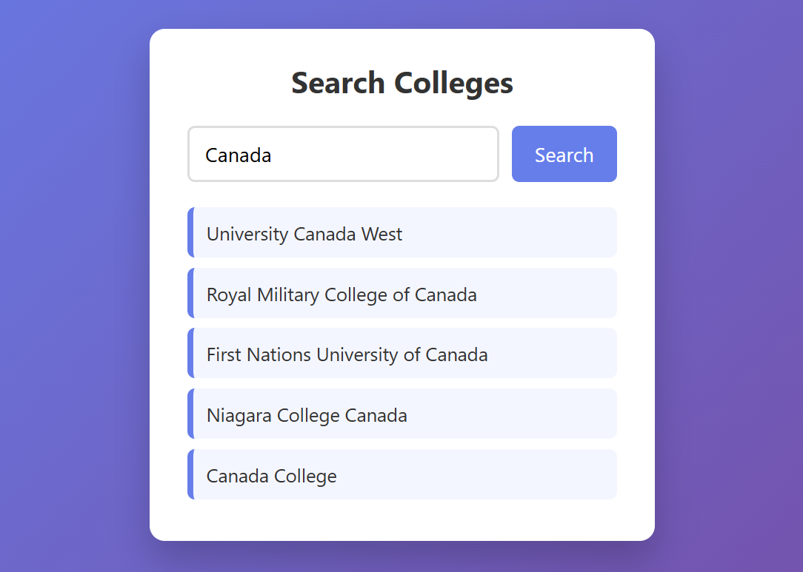

# 🎓 College Search App

A simple and clean web application that allows users to search for colleges/universities by country using a public API.  
Built using **HTML, CSS, JavaScript, and Axios**.

---

## 🚀 Features

- 🔍 Search colleges by country name
- 🌐 Fetches real-time data from Hipolabs Universities API
- 📃 Displays list of college names dynamically
- 🎨 Clean and modern UI with responsive design
- ⚡ Uses Axios for API requests

---

## 🛠️ Tech Stack

- **HTML5** – Structure
- **CSS3** – Styling & Layout
- **JavaScript (ES6+)** – Logic & DOM manipulation
- **Axios** – API calls
- **Public API** – https://universities.hipolabs.com

---

## 📷 Demo Preview

> Sample UI of the College Search App

---

## 📂 Project Structure

